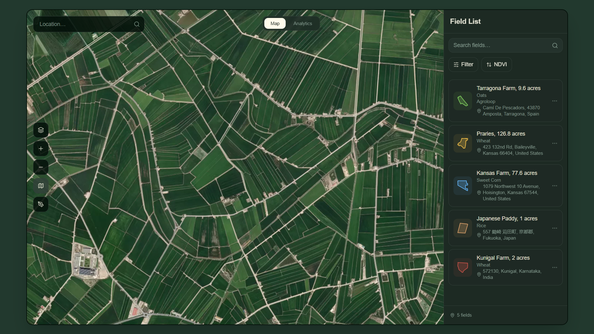
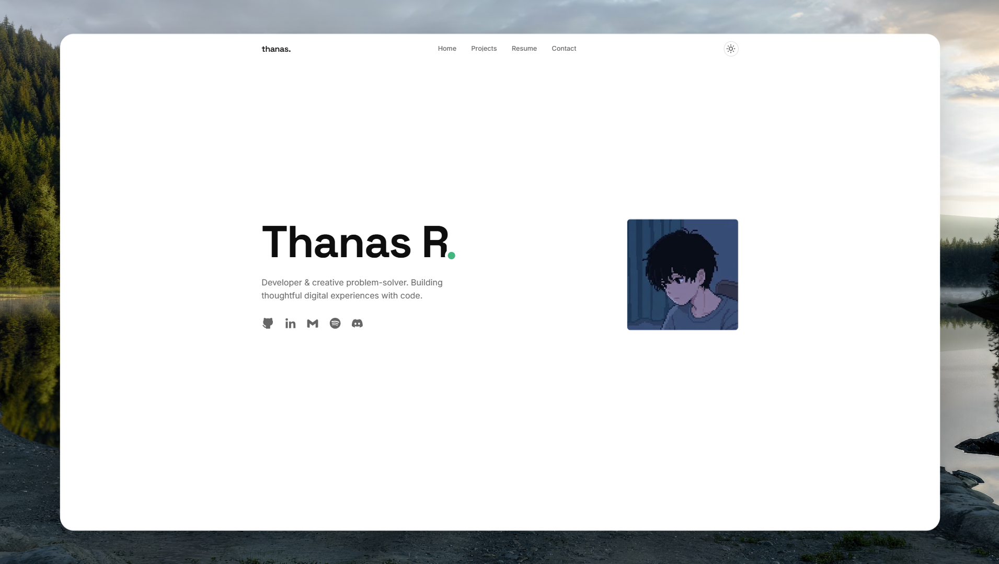
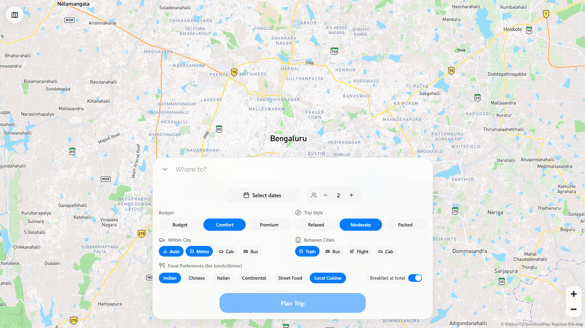
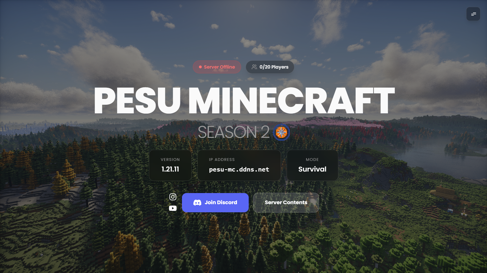
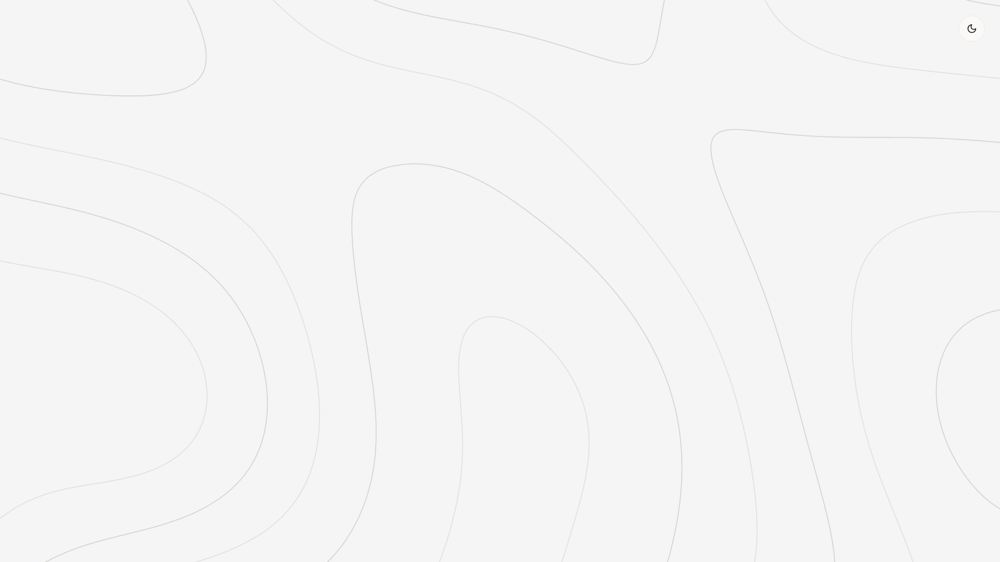
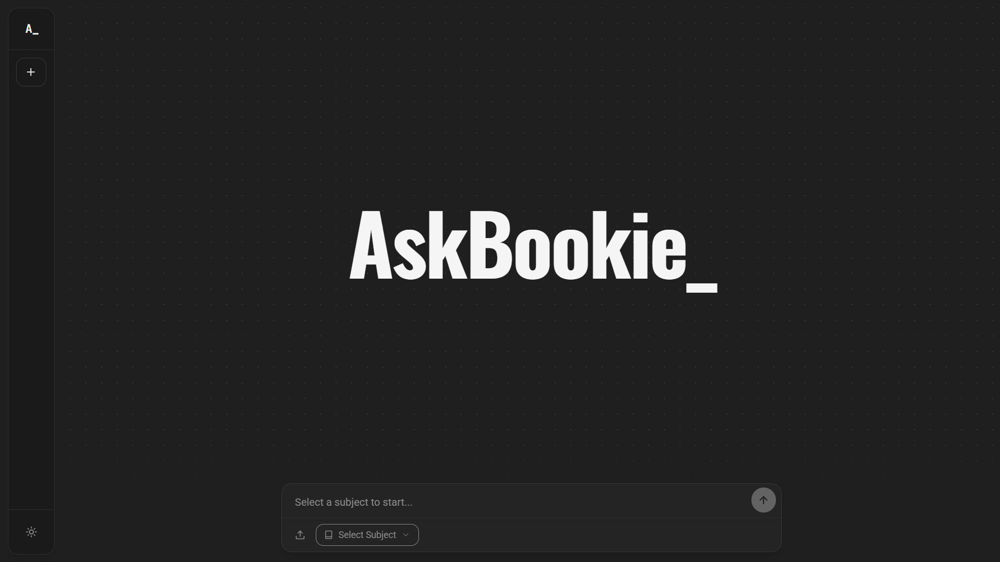
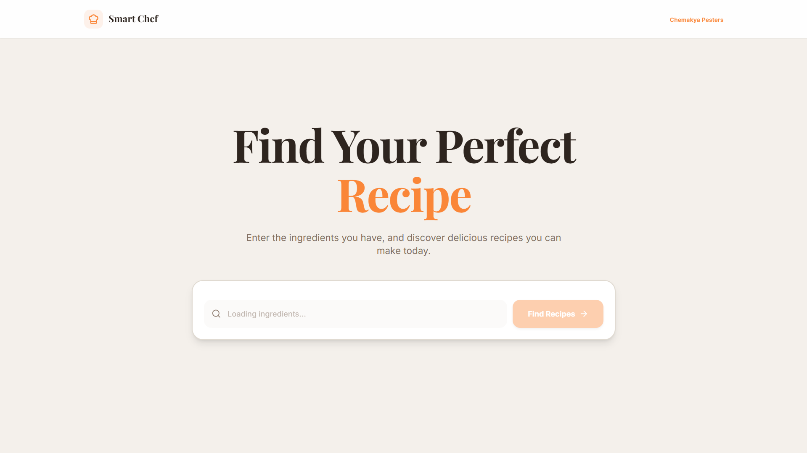
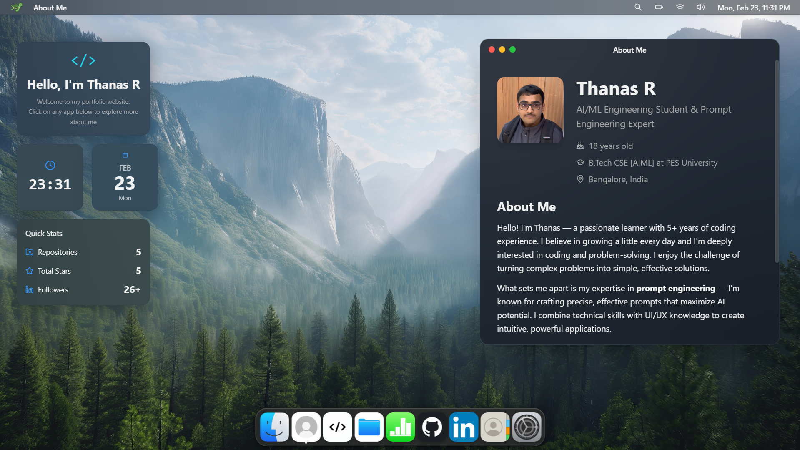
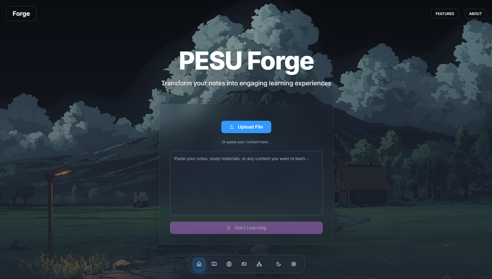

<table>
<tr>
<td width="65%" valign="top">

# Hello! I’m Thanas R

I am a passionate learner who believes in growing a little every day. I’m genuinely interested in coding and problem-solving, and I enjoy turning complex challenges into simple, effective solutions. 

While I take my work seriously, I also value creating a positive and cheerful environment. I believe a good laugh can go a long way in building strong, collaborative teams. 

I strive to be honest, supportive, and reliable, taking responsibility or leading when needed while contributing and learning with the team. 

**Connect with me:**

 &nbsp;&nbsp;&nbsp;
 &nbsp;&nbsp;
 &nbsp;&nbsp;
 
&nbsp;&nbsp;&nbsp;&nbsp;&nbsp;&nbsp;&nbsp;&nbsp;&nbsp;&nbsp;&nbsp;&nbsp;&nbsp;&nbsp;&nbsp;&nbsp;&nbsp;&nbsp;&nbsp;&nbsp;&nbsp;&nbsp;&nbsp;&nbsp;&nbsp;&nbsp;&nbsp;&nbsp;&nbsp;&nbsp;&nbsp;&nbsp;&nbsp;&nbsp;&nbsp;&nbsp;&nbsp;&nbsp;&nbsp;&nbsp;&nbsp;&nbsp;&nbsp;&nbsp;&nbsp;&nbsp;&nbsp;&nbsp;&nbsp;&nbsp;&nbsp;&nbsp;&nbsp;&nbsp;&nbsp;&nbsp;&nbsp;&nbsp;&nbsp;&nbsp;&nbsp;&nbsp;&nbsp;&nbsp;&nbsp;&nbsp;&nbsp;&nbsp;&nbsp;

</td>

<td width="29.25%" align="center" valign="middle">
  
</td>
</tr>
</table>

# Tech Stack

  &nbsp;&nbsp;&nbsp;
  &nbsp;&nbsp;&nbsp;
  &nbsp;&nbsp;&nbsp;
  &nbsp;&nbsp;&nbsp;
  &nbsp;&nbsp;&nbsp;
  &nbsp;&nbsp;&nbsp;
  &nbsp;&nbsp;&nbsp;
 &nbsp;&nbsp;&nbsp;
  &nbsp;&nbsp;&nbsp;
  &nbsp;&nbsp;&nbsp;

# Projects

> ## Upcoming Projects
> 
> 

> 
<b>Click to expand</b>

> 
>  
> 
> <table>
>   <tr>
>     <td align="center" width="50%">
>       
>       
<strong>Nautilus</strong>

>     </td>
>     <td align="center" width="50%">
>       
>       
<strong>Virdis</strong>

>     </td>
>   </tr>
>   <tr>
>     <td align="center" width="50%">
>       
>       
<strong>Portfolio</strong>

>     </td>
>     <td align="center" width="50%">
>       
>       
<strong>Spheal</strong>

>     </td>
>   </tr>
> </table>
> 
> 

> <h2>Mini Projects</h2>
> 

> 
&nbsp;Click Here

>
>  
>
> <table width="100%" style="margin-top:14px;">
>   <tr>
>     <td width="320" valign="middle" align="center">
>       <a href="https://pesu-mc.vercel.app">
>                       alt="PESU Minecraft preview" width="300" style="border-radius:12px;" />
>       </a>
>     </td>
>     <td valign="middle" style="position:relative;min-height:320px;padding:16px 56px 16px 24px;vertical-align:middle;">
>       <h3 style="margin:0 0 6px 0;">PESU Minecraft S2</h3>
>       

>         Official website for PESU Minecraft Server — Season 2. Includes events, server info, join instructions, and community updates.
>       

>       

>         <a href="https://github.com/Thanas-R/PESU-MC-S2-Website">
>           
>         </a>
>       

>     </td>
>   </tr>
> </table>
>
> <table width="100%" style="margin-top:14px;">
>   <tr>
>     <td width="320" valign="middle" align="center">
>       <a href="https://contour-flow-test.vercel.app/">
>                       alt="Contour Flow preview" width="300" style="border-radius:12px;" />
>       </a>
>     </td>
>     <td valign="middle" style="position:relative;min-height:320px;padding:16px 56px 16px 24px;vertical-align:middle;">
>       <h3 style="margin:0 0 6px 0;">Contour Flow Demo</h3>
>       

>         Lightweight animated background demo designed for subtle motion in modern portfolio websites — reusable and easy to integrate.
>       

>       

>         <a href="https://github.com/Thanas-R/contour-flow-test">
>           
>         </a>
>       

>     </td>
>   </tr>
> </table>
>
> <table width="100%">
>   <tr>
>     <td width="320" valign="middle" align="center">
>       <a href="https://askbookie.vercel.app">
>                       alt="AskBookie preview" width="300" style="border-radius:12px;" />
>       </a>
>     </td>
>     <td valign="middle" style="position:relative;min-height:320px;padding:16px 56px 16px 24px;vertical-align:middle;">
>       <h3 style="margin:0 0 6px 0;">AskBookie_</h3>
>       

>         Frontend developer for a production-ready Retrieval Augmented Generation (RAG) API.
>         AskBookie provides document Q&amp;A over PES University slide data to help students resolve course doubts quickly.
>       

>       

>         <a href="https://github.com/dotpmm/askbookie-frontend">
>           
>         </a>
>       

>     </td>
>   </tr>
> </table>
>
> <table width="100%" style="margin-top:14px;">
>   <tr>
>     <td width="320" valign="middle" align="center">
>       <a href="https://smart-chef-pesu.vercel.app/">
>                       alt="Smart Chef preview" width="300" style="border-radius:12px;" />
>       </a>
>     </td>
>     <td valign="middle" style="position:relative;min-height:320px;padding:16px 56px 16px 24px;vertical-align:middle;">
>       <h3 style="margin:0 0 6px 0;">Smart Chef</h3>
>       

>         An in-memory Vector Space Model using TF-IDF and cosine similarity to demonstrate ultra-fast similarity matching in Python.
>       

>       

>         <a href="https://github.com/Thanas-R/Smart-Chef">
>           
>         </a>
>       

>     </td>
>   </tr>
> </table>
>
> <table width="100%" style="margin-top:14px;">
>   <tr>
>     <td width="320" valign="middle" align="center">
>       <a href="https://thanas-os.vercel.app/">
>                       alt="ThanasOS preview" width="300" style="border-radius:12px;" />
>       </a>
>     </td>
>     <td valign="middle" style="position:relative;min-height:320px;padding:16px 56px 16px 24px;vertical-align:middle;">
>       <h3 style="margin:0 0 6px 0;">ThanasOS</h3>
>       

>         A macOS-themed portfolio that mimics desktop interactions while showcasing my projects and profile.
>       

>     </td>
>   </tr>
> </table>
>
> <table width="100%" style="margin-top:14px;">
>   <tr>
>     <td width="320" valign="middle" align="center">
>       <a href="https://pesu-forge.vercel.app/">
>                       alt="PESU Forge preview" width="300" style="border-radius:12px;" />
>       </a>
>     </td>
>     <td valign="middle" style="position:relative;min-height:320px;padding:16px 56px 16px 24px;vertical-align:middle;">
>       <h3 style="margin:0 0 6px 0;">PESU Forge</h3>
>       

>         AI-powered platform that converts course notes into interactive quizzes and mini-games.
>       

>       

>         <a href="https://github.com/Thanas-R/PESU-Forge">
>           
>         </a>
>       

>     </td>
>   </tr>
> </table>
>
> 

  
  &nbsp;&nbsp;&nbsp;&nbsp;
  

