 <table>
<tr>
<td width="65%" valign="top">
 
# Hello, I’m Thanas R

I am a passionate learner who believes in growing a little every day. I’m genuinely interested in coding and problem-solving, and I enjoy turning complex challenges into simple, effective solutions. 

While I take my work seriously, I also value creating a positive and cheerful environment. I believe a good laugh can go a long way in building strong, collaborative teams. 

I strive to be honest, supportive, and reliable, taking responsibility or leading when needed while contributing and learning with the team. 

**Connect with me:**

</td>

<td width="29.25%" align="center" valign="middle">
  
</td>
</tr>
</table>

# Tech Stack

# Projects

> ## Projects
> 
> 

> 
&nbsp;Click Here

> 
>  
> 
> <table width="100%" style="margin-top:14px; border-collapse:collapse;">
>   <tr>
>     <td width="320" valign="middle" align="center">
>       <a href="https://thanas.vercel.app">
>         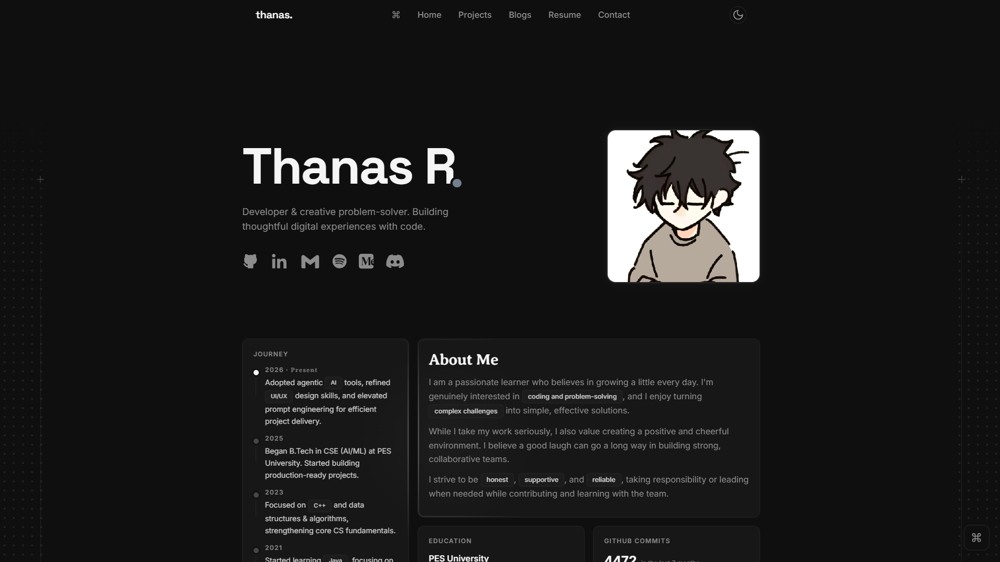
>       </a>
>     </td>
>     <td valign="middle" style="position:relative; min-height:320px; padding:16px; vertical-align:middle;">
>       <h3 style="margin:0 0 6px 0;">Portfolio Website</h3>
>       

>         My portfolio curates a wide selection of my projects, writing, and links. Explore the site to learn about my work, find interactive demos, and uncover hidden easter eggs.
>       

>       

>         <a href="https://github.com/Thanas-R/Thanas-Portfolio">
>           
>         </a>
>       

>     </td>
>   </tr>
> </table>
> 
> <table width="100%" style="margin-top:14px; border-collapse:collapse;">
>   <tr>
>     <td width="320" valign="middle" align="center">
>       <a href="https://virdis.vercel.app">
>         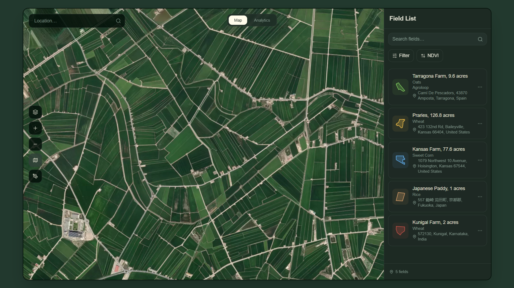
>       </a>
>     </td>
>     <td valign="middle" style="position:relative; min-height:320px; padding:16px; vertical-align:middle;">
>       <h3 style="margin:0 0 6px 0;">Virdis</h3>
>       

>         Satellite-powered agricultural and land analytics platform that combines Sentinel-2 satellite imagery, Google Earth Engine processing, real-time weather data, soil science databases, and AI-driven crop planning into a single web dashboard.
>       

>       

>         <a href="https://github.com/Thanas-R/Virdis">
>           
>         </a>
>       

>     </td>
>   </tr>
> </table>
> 
> <table width="100%" style="margin-top:14px; border-collapse:collapse;">
>   <tr>
>     <td width="320" valign="middle" align="center">
>       <a href="https://thanas-os.vercel.app/">
>         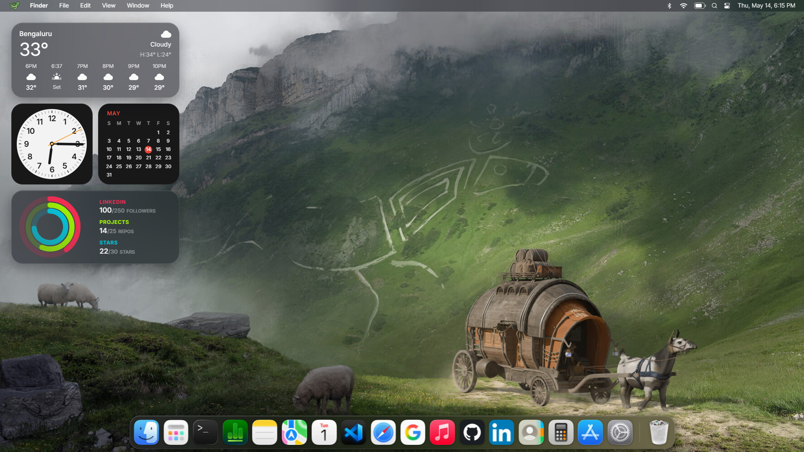
>       </a>
>     </td>
>     <td valign="middle" style="position:relative; min-height:320px; padding:16px; vertical-align:middle;">
>       <h3 style="margin:0 0 6px 0;">ThanasOS</h3>
>       

>         ThanasOS is a faithful, fully interactive recreation of macOS, rebuilt from the ground up for the browser.
>       

>       

>         <a href="https://github.com/Thanas-R/thanas-OS">
>           
>         </a>
>       

>     </td>
>   </tr>
> </table>
> 
> <table width="100%" style="margin-top:14px; border-collapse:collapse;">
>   <tr>
>     <td width="320" valign="middle" align="center">
>       <a href="https://pesu-mc.vercel.app">
>         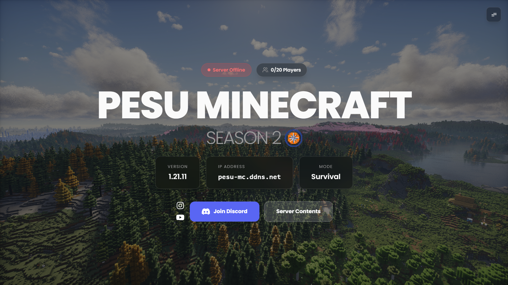
>       </a>
>     </td>
>     <td valign="middle" style="position:relative; min-height:320px; padding:16px; vertical-align:middle;">
>       <h3 style="margin:0 0 6px 0;">PESU Minecraft S2</h3>
>       

>         Official website for PESU Minecraft Server - Season 2. Includes events, server info, join instructions, and community updates.
>       

>       

>         <a href="https://github.com/Thanas-R/PESU-MC-S2-Website">
>           
>         </a>
>       

>     </td>
>   </tr>
> </table>
> 
> <table width="100%" style="margin-top:14px; border-collapse:collapse;">
>   <tr>
>     <td width="320" valign="middle" align="center">
>       <a href="https://huggingface.co/spaces/pesu-dev/askpesu-dev">
>         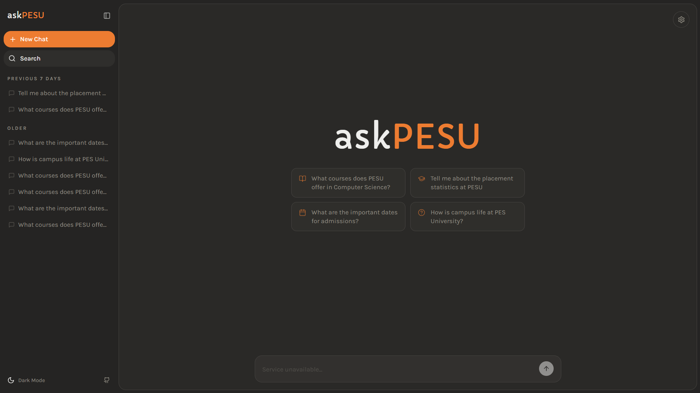
>       </a>
>     </td>
>     <td valign="middle" style="position:relative; min-height:320px; padding:16px; vertical-align:middle;">
>       <h3 style="margin:0 0 6px 0;">AskPESU</h3>
>       

>         askPESU is a RAG pipeline for question answering about PES University. Built by the PESU Dev team as a continuously updated knowledge base for current and prospective students, sourced from verified r/PESU discussions, FAQs and posts. I built the frontend and design.
>       

>       

>         <a href="https://github.com/pesu-dev/ask-pesu">
>           
>         </a>
>       

>     </td>
>   </tr>
> </table>
>
> <table width="100%" style="margin-top:14px; border-collapse:collapse;">
>   <tr>
>     <td width="320" valign="middle" align="center">
>       <a href="https://odintree.vercel.app/">
>         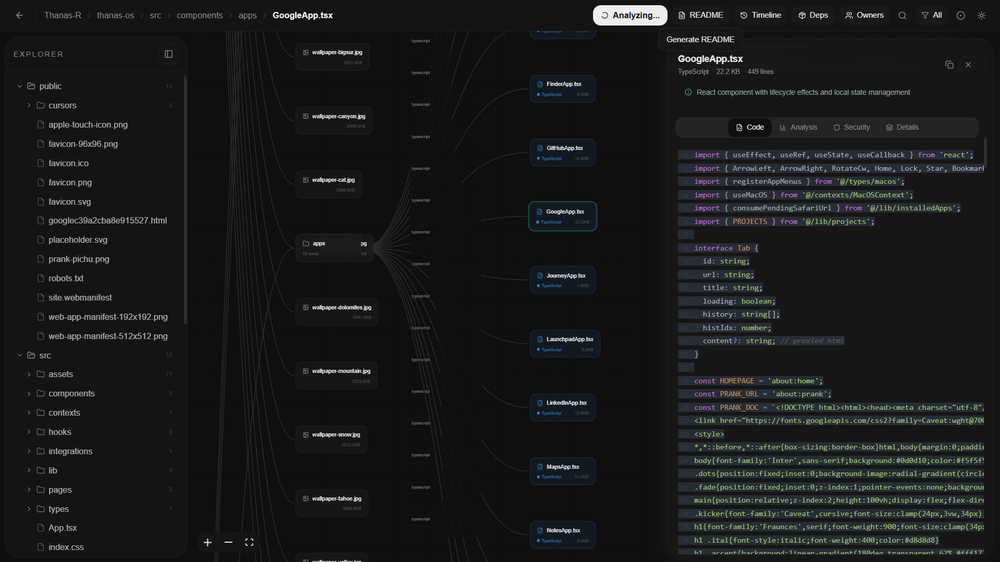
>       </a>
>     </td>
>     <td valign="middle" style="position:relative; min-height:320px; padding:16px; vertical-align:middle;">
>       <h3 style="margin:0 0 6px 0;">Odin Tree</h3>
>       

>         Odin is a visual repository explorer that turns any public GitHub project into a navigable graph, a searchable knowledge base, and a set of AI-assisted reports.
>       

>       

>         <a href="https://github.com/Thanas-R/OdinTree">
>           
>         </a>
>       

>     </td>
>   </tr>
> </table>
> 
> <table width="100%" style="margin-top:14px; border-collapse:collapse;">
>   <tr>
>     <td width="320" valign="middle" align="center">
>       <a href="https://smart-chef-pesu.vercel.app/">
>         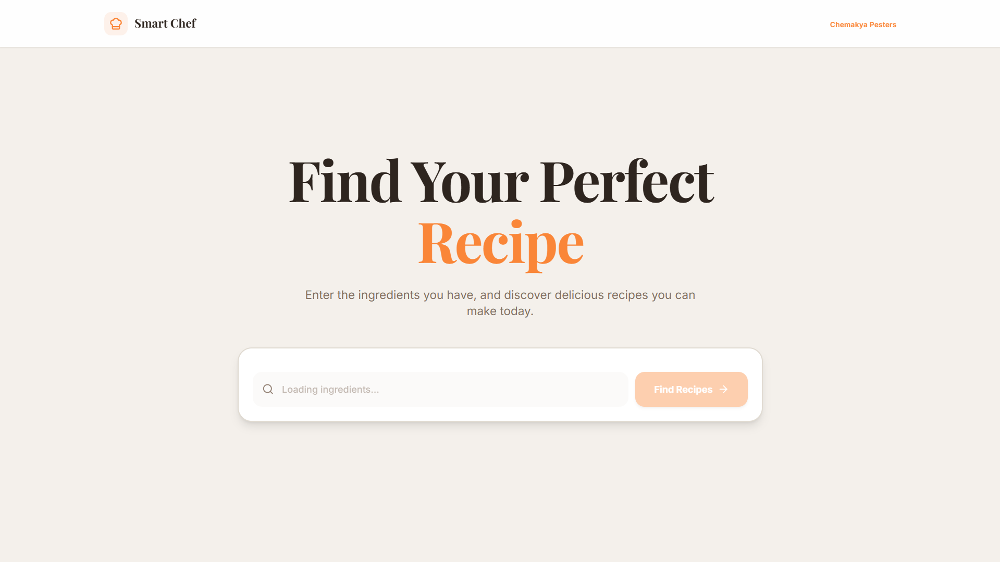
>       </a>
>     </td>
>     <td valign="middle" style="position:relative; min-height:320px; padding:16px; vertical-align:middle;">
>       <h3 style="margin:0 0 6px 0;">Smart Chef</h3>
>       

>         An in-memory Vector Space Model using TF-IDF and cosine similarity to demonstrate ultra-fast similarity matching in Python, with recipes used as a practical application domain.
>       

>       

>         <a href="https://github.com/Thanas-R/Smart-Chef">
>           
>         </a>
>       

>     </td>
>   </tr>
> </table>
> 
> <table width="100%">
>   <tr>
>     <td width="320" valign="middle" align="center">
>       <a href="https://ask-bookie.vercel.app">
>         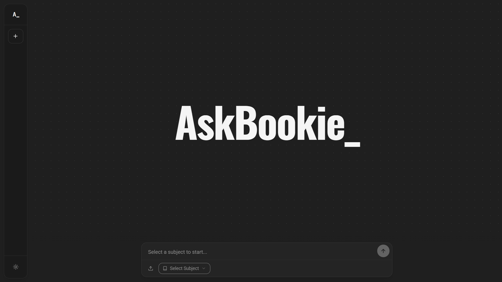              alt="AskBookie preview" width="300" style="border-radius:12px;" />
>       </a>
>     </td>
>     <td valign="middle" style="position:relative;min-height:320px;padding:16px 56px 16px 24px;vertical-align:middle;">
>       <h3 style="margin:0 0 6px 0;">AskBookie_</h3>
>       

>         Frontend developer for a production-ready Retrieval Augmented Generation (RAG) API.
>         AskBookie provides document Q&amp;A over PES University slide data to help students resolve course doubts quickly.
>       

>     </td>
>   </tr>
> </table>
>
> <table width="100%" style="margin-top:14px; border-collapse:collapse;">
>   <tr>
>     <td width="320" valign="middle" align="center">
>       <a href="https://contour-flow.vercel.app">
>         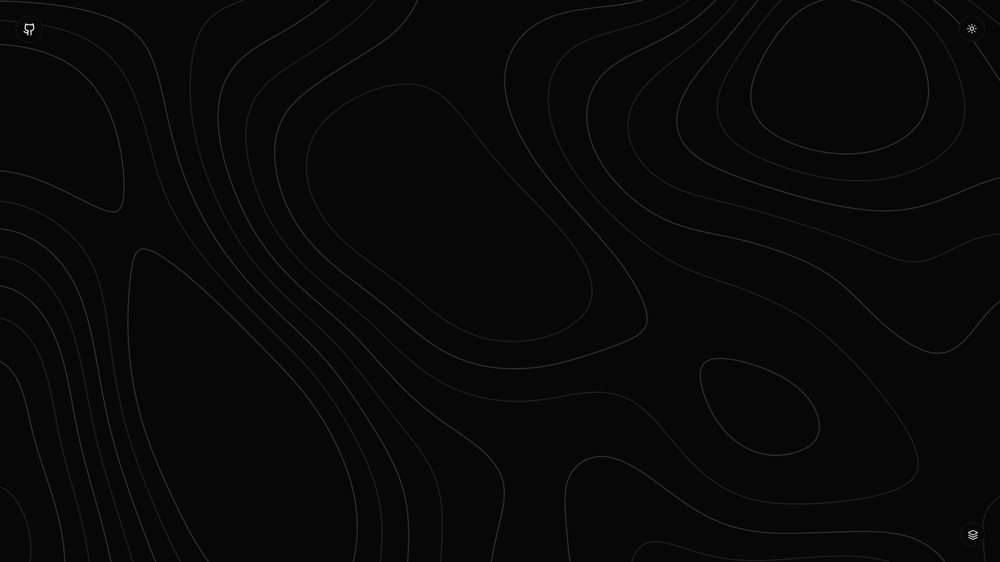
>       </a>
>     </td>
>     <td valign="middle" style="position:relative; min-height:320px; padding:16px; vertical-align:middle;">
>       <h3 style="margin:0 0 6px 0;">Contour Flow</h3>
>       

>         Lightweight animated background for subtle motion in modern React websites. A real-time procedural topographic map generator - no images, no SVGs, pure math rendered to canvas.
>       

>       

>         <a href="https://github.com/Thanas-R/contour-flow">
>           
>         </a>
>       

>     </td>
>   </tr>
> </table>
> 
> <table width="100%" style="margin-top:14px; border-collapse:collapse;">
>   <tr>
>     <td width="320" valign="middle" align="center">
>       <a href="https://pesu-forge.vercel.app/">
>         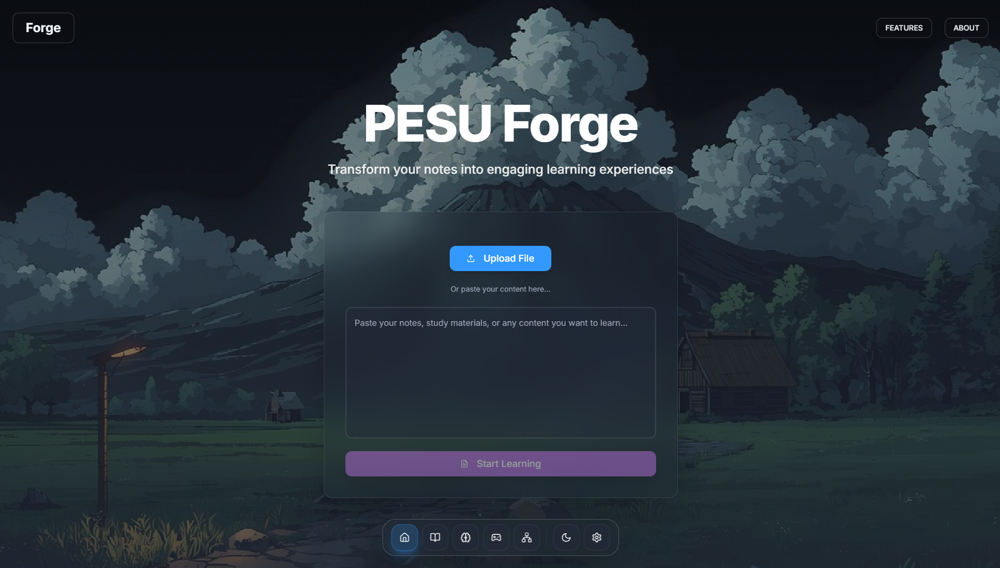
>       </a>
>     </td>
>     <td valign="middle" style="position:relative; min-height:320px; padding:16px; vertical-align:middle;">
>       <h3 style="margin:0 0 6px 0;">PESU Forge</h3>
>       

>         AI-powered platform that converts course notes into interactive quizzes and mini-games.
>       

>       

>         <a href="https://github.com/Thanas-R/PESU-Forge">
>           
>         </a>
>       

>     </td>
>   </tr>
> </table>
> 
> 

> ## Upcoming Projects
> 

> 
<b>Click to expand</b>

> 
>  
> 
> <table width="100%" style="margin-top:14px; border-collapse:collapse;">
>   <tr>
>     <td width="50%" style="padding:8px; text-align:center;">
>       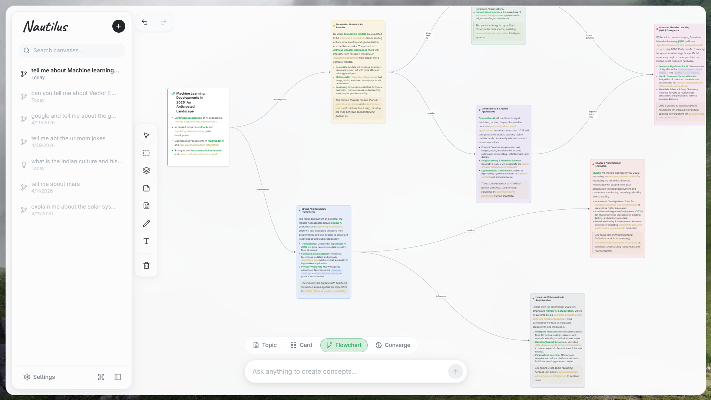
>     </td>
>     <td width="50%" style="padding:8px; text-align:center;">
>       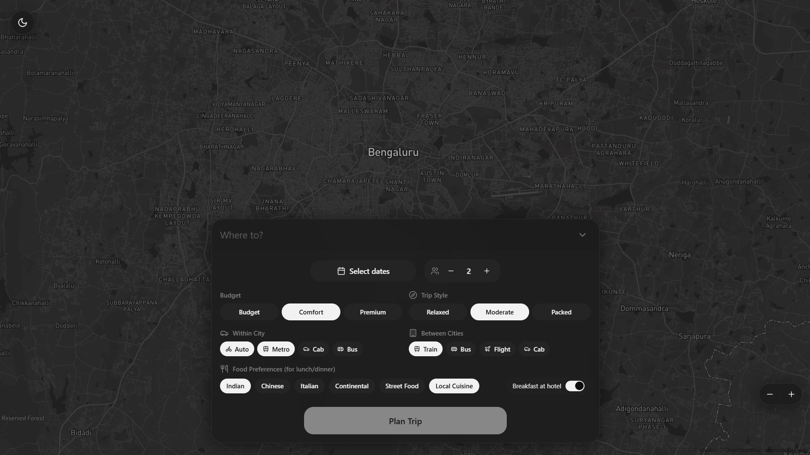
>     </td>
>   </tr>
>   <tr>
>     <td width="50%" style="text-align:center; padding:8px;">
>       <strong>Nautilus</strong>
>     </td>
>     <td width="50%" style="text-align:center; padding:8px;">
>       <strong>Spheal</strong>
>     </td>
>   </tr>
> </table>
> 
> 

  
  &nbsp;&nbsp;&nbsp;&nbsp;
  

